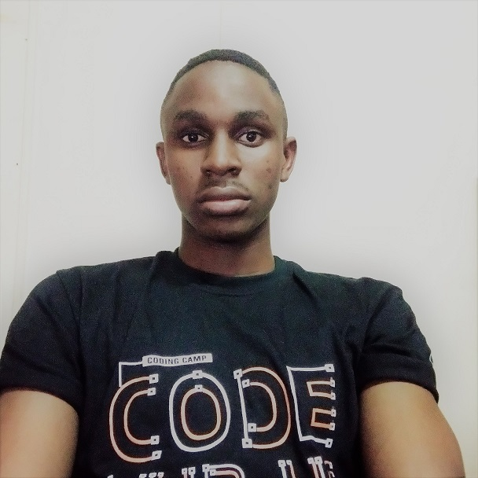

### Hi there. I am Ben Wyciff. 👋

*ben12wycliff@gmail.com \| benclifg@gmail.com*

<!--      -->
 I am a computer engineer from Kampala Uganda, currently working in the fields of data science and software development. I have a lot of passion for building things that matter and making the world a better place.

### GitHub Statistics

<!-- &nbsp; &nbsp; -->
<!-- <a>CV</a> | <a>Certificates</a> -->

<!-- ### Stats
<table>
  <tr>
    <td> :three: Internships Completed </td>
    <td> :six: Projects Completed </td>
    <td>  :four: Guided Projects  </td>
    <td>  :two: Virtual Internships </td>
  </tr>
  <tr>
    <td>  :eight: Golden Badges  </td>
    <td>  :one::zero: Skills Verified </td>
    <td>  :seven: Online Courses  </td>
    <td>  :two::six: Github Repos </td>
  </tr>
</table> -->

### Skills And Techonologies
     
<!--   -->
    

   

### Contact Me
|   |
|:---------------------------------------------------------------------------------------------------------------------------------------: |
|📞 *+256 782862788*|
|✉️ *ben12wycliff@gmail.com \| benclifg@gmail.com*|
  &nbsp; &nbsp;   |

<!--
**ben-wycliff/ben-wycliff** is a ✨ _special_ ✨ repository because its `README.md` (this file) appears on your GitHub profile.

Here are some ideas to get you started:

- 🔭 I’m currently working on ...
- 🌱 I’m currently learning ...
- 👯 I’m looking to collaborate on ...
- 🤔 I’m looking for help with ...
- 💬 Ask me about ...
- 📫 How to reach me: ...
- 😄 Pronouns: ...
- ⚡ Fun fact: ...
-->
